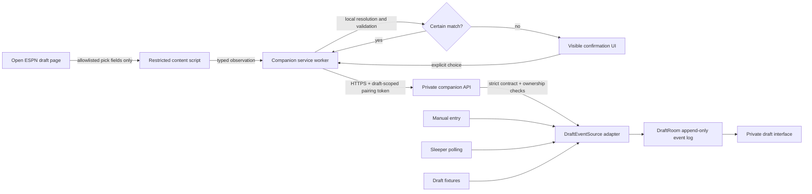

# Experimental ESPN companion architecture

## Status and scope

This document completes the architecture boundary for an optional browser companion. It does not
authorize implementation, publication, packaging, sideloading, or distribution. The repository
contains no live ESPN DOM observer, selector map, credential reader, cookie reader, or automated
draft action.

The only intended capability is read-only observation of a draft page the user has already opened,
followed by emission of narrowly structured pick and status messages to the user's private
FantasyFB application. Manual draft mode remains the supported fallback.

## Trust boundaries and data flow

The page, content script, extension worker, private API, and DraftRoom are separate trust zones.
Untrusted DOM text never crosses the content-script boundary. The private API treats every
companion message as untrusted even after pairing.

## Proposed browser permissions

The future manifest may request only:

- `storage`, used solely for an expiring pairing token in browser session storage and cleared on
  disconnect
- an ESPN host permission limited to `https://fantasy.espn.com/*`
- a content-script match limited further to `https://fantasy.espn.com/football/draft*`
- the configured FantasyFB HTTPS origin, limited by application logic to the private companion API

It must not request `cookies`, `history`, `tabs`, `webRequest`, `webRequestBlocking`, broad
`<all_urls>`, or unrelated hosts. A proposed permission fixture lives at
`fixtures/espn-companion/permissions.json`; it is deliberately not an installable manifest.

Browser manifest host permissions may grant origin-wide network access even when a path is shown.
The content-script match, runtime URL assertion, outbound API allowlist, and review test must
therefore all enforce the narrower paths.

## Component boundaries

### Content script

The content script is the only component allowed to read the ESPN draft DOM. A future
implementation must:

- start only after an explicit user enable action for the current draft
- assert the exact HTTPS origin and draft pathname before attaching an observer
- recognize a versioned page signature before reading a draft board
- observe the smallest draft-board subtree with `MutationObserver`
- extract only pick number, round, slot/team label, displayed player name, and a stable ESPN player
  or pick identifier when present
- send structured values to the service worker, never HTML, screenshots, arbitrary text, form
  fields, local storage, cookies, headers, or document-wide content
- contain no network client and no access to FantasyFB authentication

Selector and page-signature code belongs only in `apps/espn-companion`. The DraftRoom module must
never import it.

### Player resolver and confirmation

Resolution is local and fail-closed:

1. A stable ESPN player identifier is preferred and preserved as `playerExternalId`.
2. A unique exact normalized-name match may map to a canonical player ID.
3. Any ambiguous, missing, or conflicting match becomes `uncertain`.
4. An uncertain match opens user-visible confirmation UI listing only bounded candidate IDs and
   labels. No event is emitted until the user explicitly chooses a candidate.
5. The confirmed message records `manual_confirmation`, `confirmedByUser: true`, and a timestamp.

The contract intentionally has no fuzzy-match acceptance state. A future resolver can generate
candidates, but it cannot silently convert a score into a draft pick.

### Service worker and connection UI

The service worker owns pairing state, deduplication before send, compatibility policy, local
disable state, and HTTPS transport. Connection UI must always show one of `connecting`, `live`,
`unsupported`, `disabled`, or `disconnected`; it must also show the paired draft and last accepted
pick time.

Both controls below are mandatory:

- a local toolbar control that stops observation immediately and clears session state
- a server-provided emergency-disable flag that prevents pairing, rejects ingestion, and causes the
  worker to tell the content script to detach

Neither control may leave background observation active.

### Private application and pairing

Pairing must not copy ESPN credentials or reuse an ESPN session. The proposed flow is:

1. An authenticated, authorized FantasyFB user selects a draft and requests a single-use pairing
   code.
2. The user explicitly enters that short-lived code in the companion UI.
3. The private API exchanges it over HTTPS for a short-lived token bound server-side to the
   immutable FantasyFB user ID, owned draft ID, companion instance, allowed message contracts, and
   expiry.
4. The worker keeps the token only in extension session storage. It is never exposed to the content
   script.
5. Every request is authenticated, origin/content-type checked, rate limited, size limited, and
   checked against the pairing's user and draft. A browser-submitted user ID is ignored.
6. Disconnect, expiry, emergency disable, or authorization failure revokes the pairing.

This token is a FantasyFB capability, not an ESPN credential. Production transport must use HTTPS
and must not accept query-string tokens.

## Versioned wire contracts

`modules/draft-room/src/espn-companion.ts` owns strict version 1 schemas for two allowlisted
messages. Unknown keys are rejected so unrelated page content cannot hitchhike through the
transport.

### Pick message

`fantasyfb.espn-companion.pick` carries:

- contract, contract version, message ID, companion version, and observer version
- the paired FantasyFB draft ID and observation time
- `pick_recorded`, `pick_corrected`, or `pick_removed`
- stable provider event identity and the minimum pick coordinates
- a bounded player-resolution record

Acceptance requires an enabled server policy, contract version 1, an allowlisted observer version,
the exact token-bound draft ID, a new message ID, and a resolved or explicitly confirmed player.
An accepted message becomes the same `NewDraftEvent` consumed by Sleeper, manual, and fixture
sources, with `source: "espn_companion"`. Database idempotency on `eventId` is the final duplicate
barrier.

### Status message

`fantasyfb.espn-companion.status` carries only fixed state and reason vocabularies. It has no free
text or page-content field. `unsupported` plus `page_signature_unknown` is the required response to
an unrecognized ESPN page structure.

## Duplicate and correction behavior

- `messageId` is stable for one provider pick revision and becomes the normalized `eventId`.
- The worker keeps a bounded session set of sent message IDs.
- The server rejects or acknowledges already-seen IDs without appending a second event.
- The database's per-draft idempotency key protects against retries and concurrent delivery.
- A changed pick creates a new `pick_corrected` message that references the prior normalized event.
- A removed pick creates `pick_removed` with the same explicit correction relationship.
- No existing event is overwritten; replay remains deterministic.

## Compatibility and failure behavior

The server distributes an allowlist of supported observer versions during pairing. A future observer
must recognize its expected page signature before emitting anything. If the DOM changes, a
required field disappears, the selector becomes ambiguous, or versions are incompatible:

1. detach the observer and stop emitting events
2. send the fixed `unsupported/page_signature_unknown` status when safe
3. show a persistent unsupported-state warning
4. keep the last accepted append-only draft state
5. preserve manual draft entry and never invent the missing picks

Network interruption similarly stops delivery, shows `disconnected/network_unavailable`, and
preserves manual mode. Reconnection may retry stable message IDs; idempotency makes this safe.

## Observability without sensitive logging

Permitted metrics are contract version, companion version, observer version, status/reason code,
message ID hash, paired draft ID hash, acceptance result, latency, and duplicate count. Logs must
not contain ESPN cookies, FantasyFB pairing tokens, page HTML, player-page text, passwords,
browsing history, arbitrary URLs, or unrelated private league payloads.

## Implementation gate

Live page observation remains blocked until a separate approved change includes:

- an installable manifest matching the reviewed permission fixture
- selector/page-signature fixtures created from synthetic markup, not private captures
- content-script data-minimization tests
- pairing API authorization, CSRF/origin, expiry, revocation, and rate-limit tests
- a visible connection/confirmation/disable UI
- compatibility and unknown-DOM fail-closed tests
- a security review against the companion threat model

Passing this gate would authorize review, not automatic publication or distribution.
